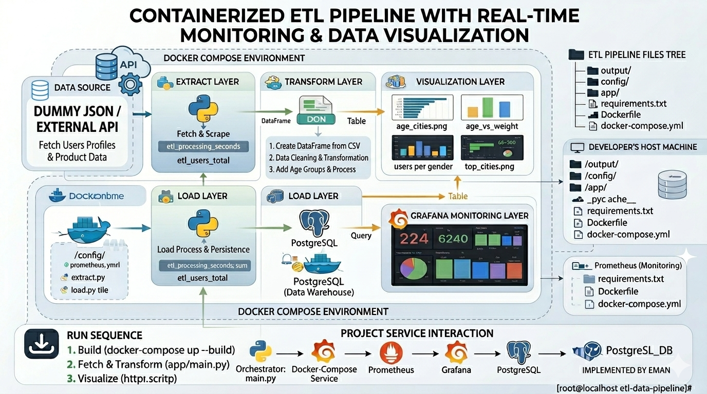
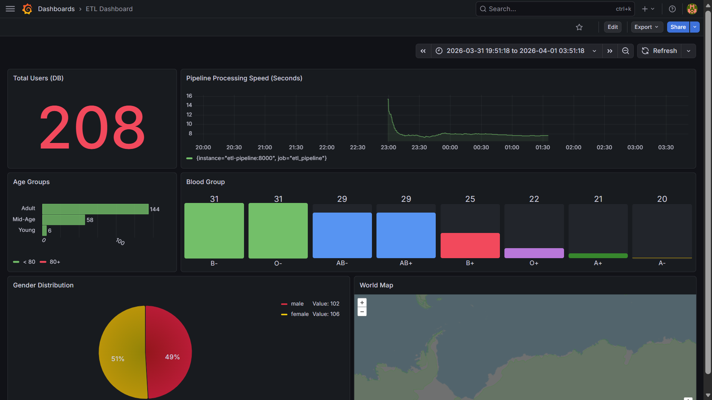

# 🚀 Dockerized ETL Pipeline: From API to Insights with Monitoring Dashboard


---

## 🧠 Project Overview

This project is a **production-ready, containerized ETL pipeline** that automates the full data lifecycle:

➡️ Extract data from API
➡️ Transform & clean data
➡️ Load into PostgreSQL
➡️ Generate insights & visualizations
➡️ Monitor performance in real-time

---

## 🏗️ Architecture



---

## ⚙️ ETL Pipeline

### 🔹 1. Extract (`app/extract.py`)

* Fetch data from API using pagination
* Convert JSON → structured format

---

### 🔹 2. Transform (`app/transform.py`)

* Data cleaning & preprocessing
* Handle missing values
* Remove duplicates
* Feature Engineering:

  * Age Groups
  * BMI
  * Email Domains

---

### 🔹 3. Load (`app/load.py`)

* Save data to:

  * CSV → `output/data/`
  * PostgreSQL (Data Warehouse)

---

### 📊 4. Visualization

* Generate multiple plots:

  * Age distribution
  * Gender analysis
  * Top cities
  * Correlations
* Saved in:

```
output/plots/
```

---

## 📡 Monitoring

The pipeline is fully monitored using:

* Prometheus → collects metrics
* Grafana → dashboards 


### 📈 Metrics:

* `etl_processing_seconds` → execution time
* `etl_users_total` → processed users

---

## 🐳 Docker Environment

The entire system runs using **Docker Compose**, including:

* ETL Pipeline
* PostgreSQL
* Prometheus
* Grafana

---

## ▶️ How to Run

### 1️⃣ Clone repo

```
git clone https://github.com/YOUR_USERNAME/etl-data-pipeline.git
cd etl-data-pipeline
```

---

### 2️⃣ Run project

```
docker-compose up --build
```

---

### 3️⃣ Access services

* 📊 Grafana → http://localhost:3000
* 📡 Prometheus → http://localhost:9090

---

## 📂 Project Structure

```
.
.
├── app/
│   ├── main.py          # Pipeline Orchestrator
│   ├── extract.py       # API Ingestion
│   ├── transform.py     # Cleaning & Logic
│   └── load.py          # DB Persistence
├── config/
│   ├── prometheus.yml   # Metrics Config
│   └── dashboard.json   # Pre-configured Grafana Dashboard
├── output/
│   ├── data/            # Processed CSV Backups
│   └── plots/           # Seaborn/Matplotlib Visualizations
├── docker-compose.yml   # Multi-container Orchestration
└── Dockerfile           # Python Environment Image
└── README.md
```

---

## 🛠️ Tech Stack

* Python
* Pandas
* Requests
* Seaborn & Matplotlib
* PostgreSQL
* Docker & Docker Compose
* Prometheus
* Grafana

---

## 🎯 Key Learnings

* Building modular ETL pipelines
* Containerizing data workflows
* Working with Data Warehouses
* Monitoring pipelines in real-time
* Structuring production-ready projects

---

## 👩‍💻 Author

**Eman Abdelmohsen Elbordeny**
Data Engineer

🔗 LinkedIn: [PUT YOUR LINK]
🔗 GitHub: [PUT YOUR LINK]
